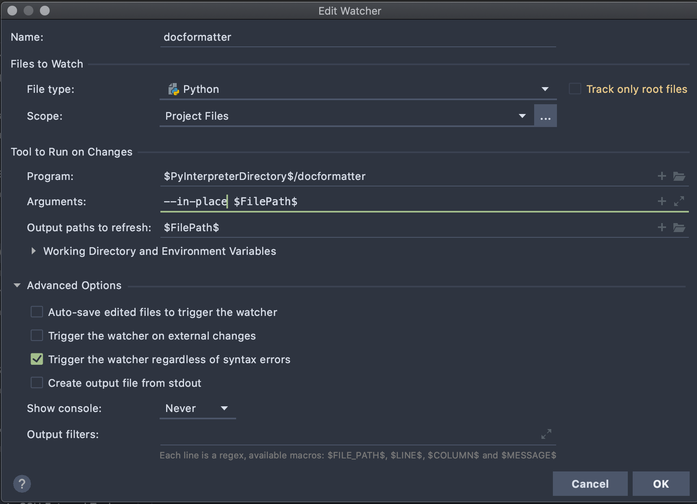

============
docformatter
============

.. |CI| image:: https://img.shields.io/github/workflow/status/PyCQA/docformatter/CI
.. |CONTRIBUTORS| image:: https://img.shields.io/github/contributors/PyCQA/docformatter
.. |COMMIT| image:: https://img.shields.io/github/last-commit/PyCQA/docformatter
.. |BLACK| image:: https://img.shields.io/badge/%20style-black-000000.svg
    :target: https://github.com/psf/black
.. |ISORT| image:: https://img.shields.io/badge/%20imports-isort-%231674b1
    :target: https://pycqa.github.io/isort/
.. |SELF| image:: https://img.shields.io/badge/%20formatter-docformatter-fedcba.svg
    :target: https://pycqa.github.io/docformatter/
.. |DOCSTYLE| image:: https://img.shields.io/badge/%20style-numpy-459db9.svg
    :target: https://numpydoc.readthedocs.io/en/latest/format.html

.. |VERSION| image:: https://img.shields.io/pypi/v/docformatter
.. |LICENSE| image:: https://img.shields.io/pypi/l/docformatter
.. |PYVERS| image:: https://img.shields.io/pypi/pyversions/docformatter
.. |PYMAT| image:: https://img.shields.io/pypi/format/docformatter
.. |DD| image:: https://img.shields.io/pypi/dd/docformatter

+----------------+----------------------------------------------------------+
| **Code**       + |BLACK| |ISORT|                                          +
+----------------+----------------------------------------------------------+
| **Docstrings** + |SELF| |DOCSTYLE|                                        +
+----------------+----------------------------------------------------------+
| **GitHub**     + |CI| |CONTRIBUTORS| |COMMIT|                             +
+----------------+----------------------------------------------------------+
| **PyPi**       + |VERSION| |LICENSE| |PYVERS| |PYMAT| |DD|                +
+----------------+----------------------------------------------------------+

Formats docstrings to follow `PEP 257`_.

.. _`PEP 257`: http://www.python.org/dev/peps/pep-0257/

Features
========

*docformatter* automatically formats docstrings to follow a subset of the PEP 257 conventions. Below are the relevant items quoted from PEP 257.

- For consistency, always use triple double quotes around docstrings.
- Triple quotes are used even though the string fits on one line.
- Multi-line docstrings consist of a summary line just like a one-line
  docstring, followed by a blank line, followed by a more elaborate
  description.
- Unless the entire docstring fits on a line, place the closing quotes
  on a line by themselves.

docformatter also handles some of the PEP 8 conventions.

- Don't write string literals that rely on significant trailing
  whitespace. Such trailing whitespace is visually indistinguishable
  and some editors (or more recently, reindent.py) will trim them.

Installation
============

From pip::

    $ pip install --upgrade docformatter

Or, if you want to use pyproject.toml to configure docformatter::

    $ pip install --upgrade docformatter[tomli]

Example
=======

After running::

    $ docformatter --in-place example.py

this code

.. code-block:: python

    """   Here are some examples.

        This module docstring should be dedented."""

    def launch_rocket():
        """Launch
    the
    rocket. Go colonize space."""

    def factorial(x):
        '''

        Return x factorial.

        This uses math.factorial.

        '''
        import math
        return math.factorial(x)

    def print_factorial(x):
        """Print x factorial"""
        print(factorial(x))

    def main():
        """Main
        function"""
        print_factorial(5)
        if factorial(10):
            launch_rocket()

gets formatted into this

.. code-block:: python

    """Here are some examples.

    This module docstring should be dedented.
    """

    def launch_rocket():
        """Launch the rocket.

        Go colonize space.
        """

    def factorial(x):
        """Return x factorial.

        This uses math.factorial.
        """
        import math
        return math.factorial(x)

    def print_factorial(x):
        """Print x factorial."""
        print(factorial(x))

    def main():
        """Main function."""
        print_factorial(5)
        if factorial(10):
            launch_rocket()

Options
=======

Below is the help output::

    usage: docformatter [-h] [-i | -c] [-r] [--wrap-summaries length]
                        [--wrap-descriptions length] [--blank]
                        [--pre-summary-newline] [--make-summary-multi-line]
                        [--force-wrap] [--range start_line end_line]
                        [--docstring-length min_length max_length] [--version]
                        files [files ...]

    Formats docstrings to follow PEP 257.

    positional arguments:
      files                 files to format or '-' for standard in

    optional arguments:
      -h, --help            show this help message and exit
      -i, --in-place        make changes to files instead of printing diffs
      -c, --check           only check and report incorrectly formatted files
      -r, --recursive       drill down directories recursively
      -e, --exclude         exclude directories and files by names

      --wrap-summaries length
                            wrap long summary lines at this length; set to 0 to
                            disable wrapping (default: 79)
      --wrap-descriptions length
                            wrap descriptions at this length; set to 0 to disable
                            wrapping (default: 72)
      --tab-width width     tabs in indentation are counted as this many
                            characters when wrapping lines (default: 1)
      --blank               add blank line after description
      --pre-summary-newline
                            add a newline before the summary of a multi-line
                            docstring
      --make-summary-multi-line
                            add a newline before and after the summary of a one-
                            line docstring
      --force-wrap          force descriptions to be wrapped even if it may result
                            in a mess
      --range start_line end_line
                            apply docformatter to docstrings between these lines;
                            line numbers are indexed at 1
      --docstring-length min_length max_length
                            apply docformatter to docstrings of given length range
      --strict              strictly follow reST syntax to identify lists (see issue #67)
      --version             show program's version number and exit
      --config CONFIG       path to file containing docformatter options

Possible exit codes:

- **1** - if any error encountered
- **3** - if any file needs to be formatted (in ``--check`` mode)

docformatter options can also be stored in a configuration file.  Currently only
pyproject.toml is supported.  Add section [tool.docformatter] with options listed using
the same name as command line options.  For example::

      [tool.docformatter]
      recursive = true
      wrap-summaries = 82
      blank = true

Command line options take precedence.  The configuration file can be passed with a full
path, otherwise docformatter will look in the current directory.  For example::

      docformatter --config ~/.secret/path/to/pyproject.toml

Wrapping descriptions
=====================

docformatter will wrap descriptions, but only in simple cases. If there is text
that seems like a bulleted/numbered list, docformatter will leave the
description as is::

    - Item one.
    - Item two.
    - Item three.

This prevents the risk of the wrapping turning things into a mess. To force
even these instances to get wrapped use ``--force-wrap``.

Integration
===========

Git Hook
--------

*docformatter* is configured for `pre-commit`_ and can be set up as a hook with the following ``.pre-commit-config.yaml`` configuration:

.. _`pre-commit`: https://pre-commit.com/

.. code-block:: yaml

  - repo: https://github.com/myint/docformatter
    rev: v1.3.1
    hooks:
      - id: docformatter
        args: [--in-place]

You will need to install ``pre-commit`` and run ``pre-commit install``.

You may alternatively use  ``args: [--check]`` if you prefer the commit to fail instead of letting *docformatter* format  docstrings automatically.

PyCharm
-------

*docformatter* can be configured as a PyCharm file watcher to automatically format docstrings on saving python files.

Head over to ``Preferences > Tools > File Watchers``, click the ``+`` icon and configure *docformatter* as shown below:

Marketing
=========
Do you use *docformatter*?  What style docstrings do you use?  Add some badges to your project's **README** and let everyone know.

|SELF|

.. code-block::

	.. image:: https://img.shields.io/badge/%20formatter-docformatter-fedcba.svg
  	  :target: https://pycqa.github.io/docformatter/

.. image:: https://img.shields.io/badge/%20style-google-3666d6.svg
	    :target: https://google.github.io/styleguide/pyguide.html#s3.8-comments-and-docstrings

.. code-block::

	.. image:: https://img.shields.io/badge/%20style-google-3666d6.svg
	    :target: https://google.github.io/styleguide/pyguide.html#s3.8-comments-and-docstrings

|DOCSTYLE|

.. code-block::

	.. image:: https://img.shields.io/badge/%20style-numpy-459db9.svg
  	  :target: https://numpydoc.readthedocs.io/en/latest/format.html

.. image:: https://img.shields.io/badge/%20style-sphinx-0a507a.svg
	    :target: https://www.sphinx-doc.org/en/master/usage/index.html

.. code-block::

	.. image:: https://img.shields.io/badge/%20style-sphinx-0a507a.svg
	    :target: https://www.sphinx-doc.org/en/master/usage/index.html

Issues
======

Bugs and patches can be reported on the `GitHub page`_.

.. _`GitHub page`: https://github.com/myint/docformatter/issues

Links
=====

* Coveralls_

.. _`Coveralls`: https://coveralls.io/r/myint/docformatter
